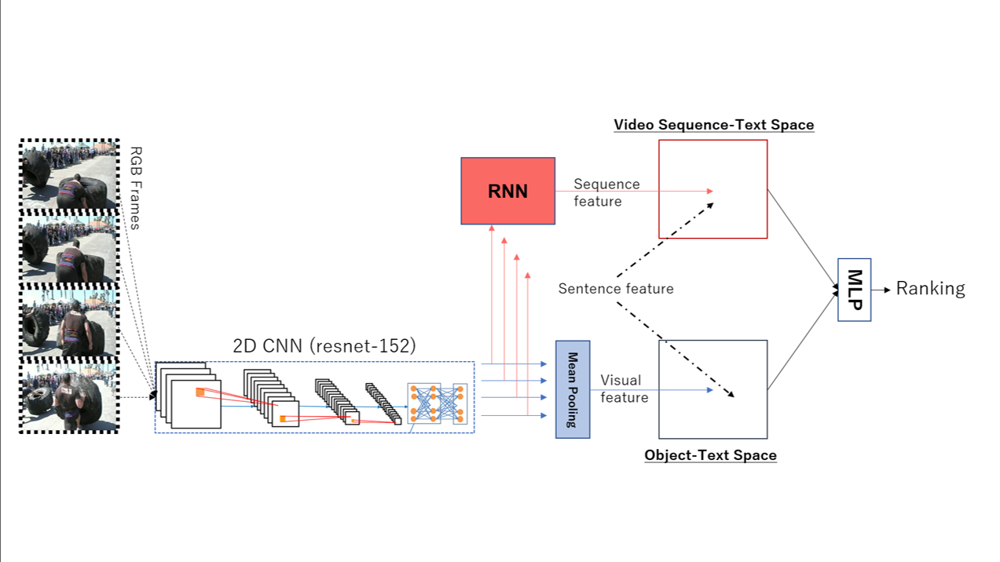

# Text-To-Video Information Retrieval

This repository contains the demo code for a simplified version of a Visual-Semantic Embedding model for learning joint video-text representation. You can replicate the learning process and perform Text-To-Video Retrieval on the [MSVD dataset](http://www.cs.utexas.edu/users/ml/clamp/videoDescription/).

## Features:

 * Utilize both visual and sequence information from video
 * [GloVe](https://nlp.stanford.edu/projects/glove/) for text-embedding, NetVLAD for sentence representation, ResNet-152 for visual features
 * MLPs for combining similarity scores
 * Use pre-extracted features, train fast

## Architecture

## Requirements

 - Python v2.7.0 (will release Python 3 version)
 - [PyTorch v0.4 and newer](https://pytorch.org/)
 - [Pre-extracted features](https://drive.google.com/open?id=1HzL6vxe0Y36ksUS7PllINo80OoK0dqa2)

## Train:

Assuming you have a dataset and features extracted in the data folder:

  ``
 train.py --epochs=20 --batch_size=64 --lr=0.00001
 ``
Further adjustments can be done by adding compiling arguments